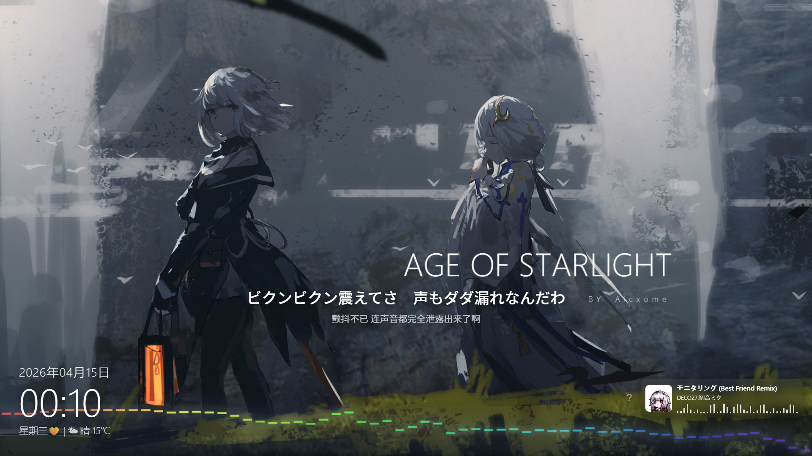
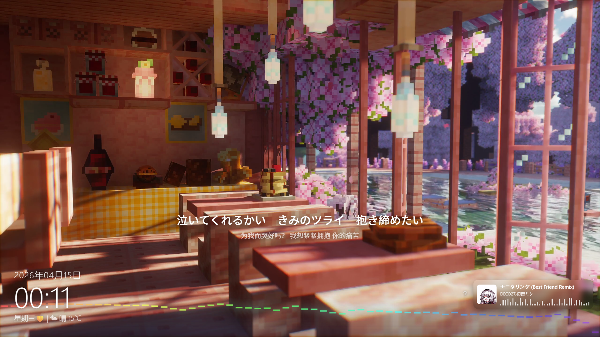
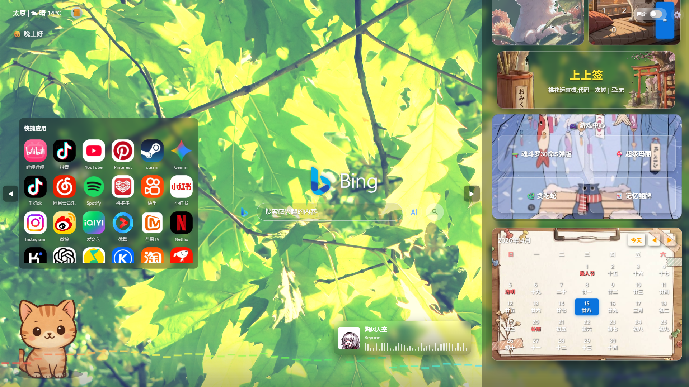

# G-web：重塑您的新标签页体验 🚀

> **“大学生搓了半年（AI也没少用）的新标签页浏览器扩展，虽然还有蛮多不足，但已经燃尽了 (￣y▽￣)╭ ”**

G-web 是一款全能型浏览器扩展，旨在将枯燥的新标签页转化为高度个性化、交互式的仪表盘。它集成了生产力工具、娱乐功能和迷人的互动元素，专为提升您的浏览乐趣而设计。

---

## 📥 安装与使用

1. **直接获取**：[点击前往 Microsoft Edge Addons 安装](https://microsoftedge.microsoft.com/addons/detail/lfbikpcfmfimdobgkopcnammkfmifinp)
2. **启用插件**：安装后打开新标签页即可看到 G-web。
3. **功能菜单**：点击左上角的菜单按钮，即可访问所有内置功能。

---

## 🌟 核心特性

| 分类 | 功能描述 |
| :--- | :--- |
| **个性化** | 支持内置图库、动态视频背景，或上传自定义素材。布局高度灵活，可自由固定组件。 |
| **生产力** | 集成待办事项 (Todo)、带提醒的日历、计算器、实时天气、每日便签及倒计时。 |
| **交互娱乐** | **虚拟猫伴侣**（`Alt + C` 唤醒/隐藏）、内置贪吃蛇游戏、每日运势抽签。 |
| **媒体控制** | 自动检测浏览器播放内容，提供实时控制、歌曲信息及生动的波形动画。 |
| **万能搜索** | 统一搜索栏，集成 Bing、Google、百度、搜狗，支持实时联想与一键切换。 |

---

## 📸 界面预览

---

## 🛠 使用指南

- **侧边栏导航**：使用左侧侧边栏快速开启待办、日历、天气等核心组件。
- **互动猫咪**：随时按下 `Alt + C` 召唤你的电子宠物。
- **外观定制**：通过右键菜单或设置面板更换壁纸及调整组件位置。
- **隐私保护**：**零数据收集**。所有偏好设置、待办事件和数据均加密存储在您的本地设备中，绝不上传云端。

---

## 💌 建议与反馈

如果你有好的壁纸推荐、想听的歌曲，或者遇到了 Bug：
- **Bilibili**: 扩展右下角
- **Email**: [qwer2414701603@gmail.com](mailto:qwer2414701603@gmail.com)

如果你喜欢这个项目，欢迎点一个 **Star** ⭐，这是对开发者最大的鼓励！

---
*Developed with ❤️ by shichen1234*
