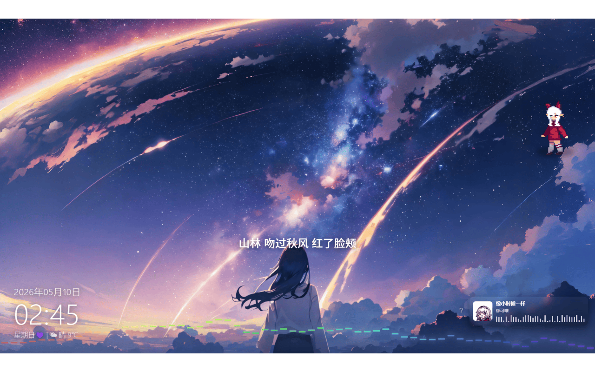
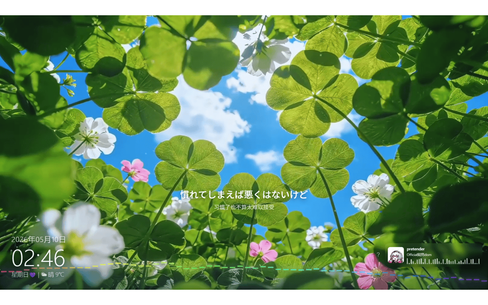
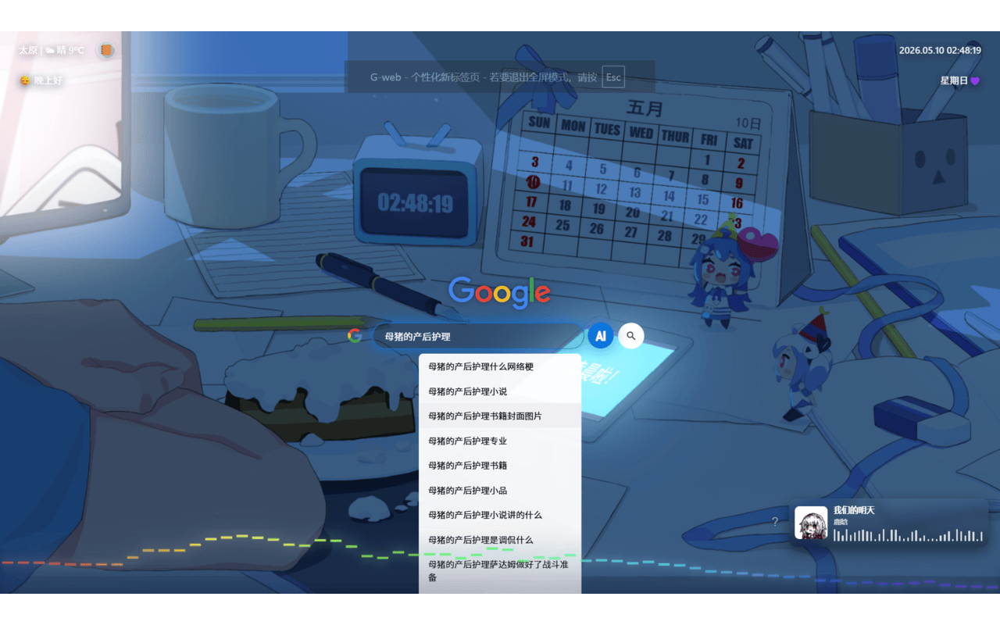
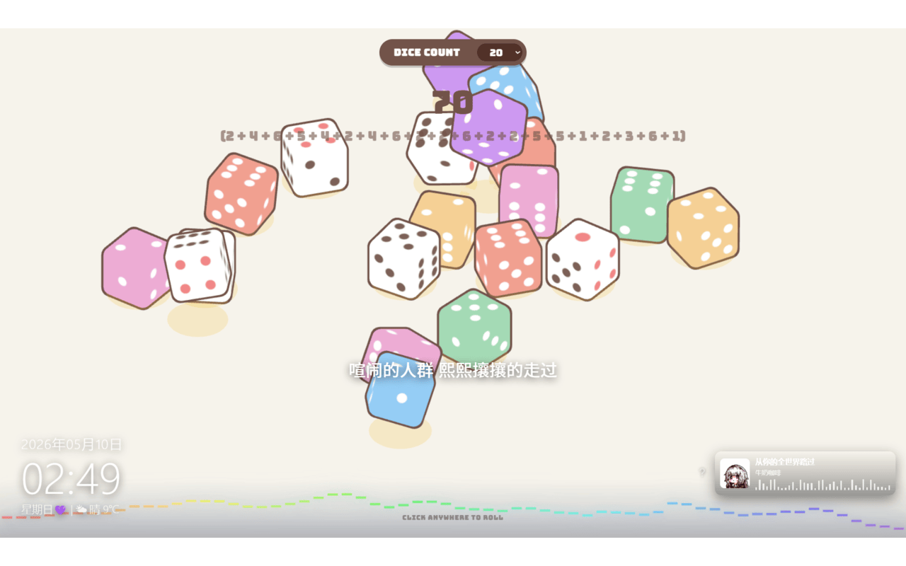
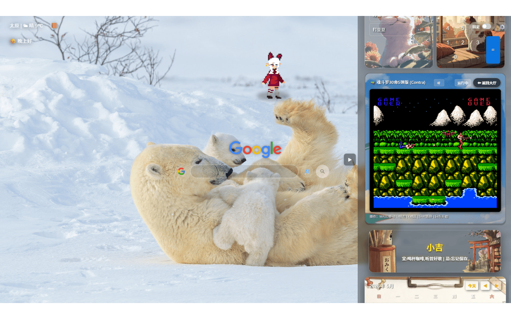
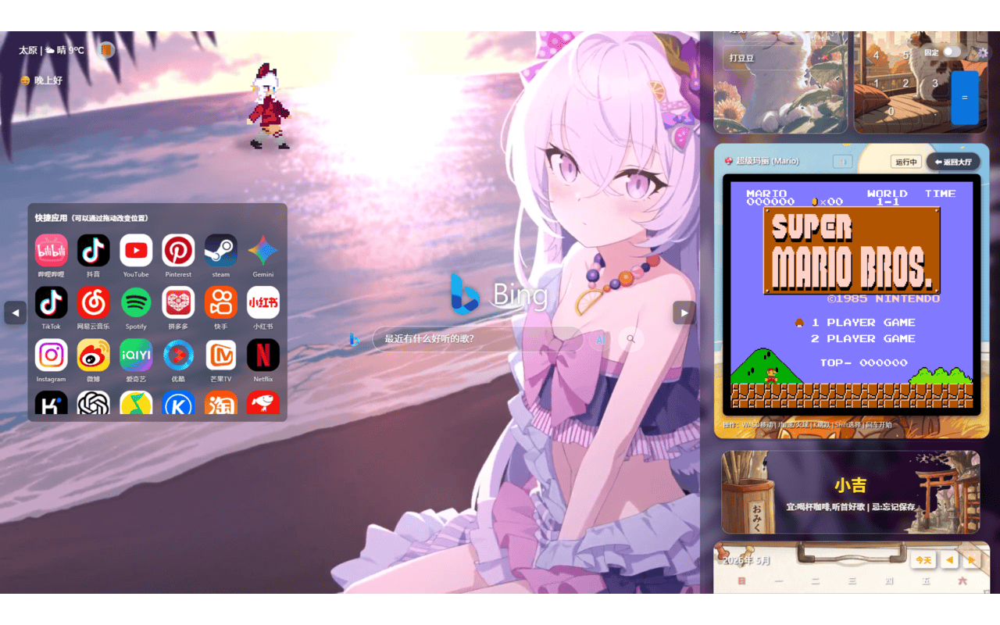

# G-web 🚀

**Transform your boring new tab into a vibrant, highly customizable personal dashboard.**

[Installation](#-installation) • [Key Features](#-key-features) • [Preview](#-preview) • [Privacy](#-privacy) • [Feedback](#-feedback)

---

## 📥 Installation

1. **Install Extension**: Get it directly from the [Microsoft Edge Add-ons Store](https://microsoftedge.microsoft.com/addons/detail/lfbikpcfmfimdobgkopcnammkfmifinp).
2. **Launch**: Open a new tab to start using G-web instantly.
3. **Configure**: Click the menu button in the top-left corner to access all built-in widgets and customization options.

---

## 🌟 Key Features

| Category | Description |
| :--- | :--- |
| **Personalization** | Curated gallery, live video wallpapers, or custom asset uploads. Flexible drag-and-pin widget layouts. |
| **Productivity** | Integrated Todo list, Calendar, Calculator, real-time Weather, and Birthday Countdown. |
| **Interactive Pet** | **Virtual Cat Companion** (press `Alt + C` to toggle), built-in Snake game, and Daily Fortune draws. |
| **Media Controller** | Auto-detects browser audio playback with track metadata and dynamic visualizer waveforms. |
| **Omni-Search** | Unified search bar supporting Bing, Google, Baidu, and Sogou with live auto-complete and one-click switching. |

---

## 📸 Preview

  
  
   
  
  

<b>🔍 View More Screenshots</b>

 

  
  

---

## 🔒 Privacy First

* **Zero Data Collection**: We do not collect, track, or share any personal browsing habits.
* **Local-Only Storage**: All settings, tasks, and credentials remain securely stored within your local browser storage.

---

## 💌 Feedback & Community

Found a bug or have a feature request?
* **Issues**: [Open an issue on GitHub](https://github.com/shichen1234/G-web/issues)
* **Email**: [qwer2414701603@gmail.com](mailto:qwer2414701603@gmail.com)

If you find this project helpful, please consider giving it a **Star** ⭐ — it keeps the project alive and growing!

---

Developed with ❤️ by <a href="https://github.com/shichen1234">shichen1234</a>

